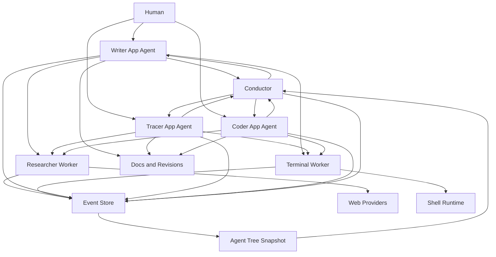
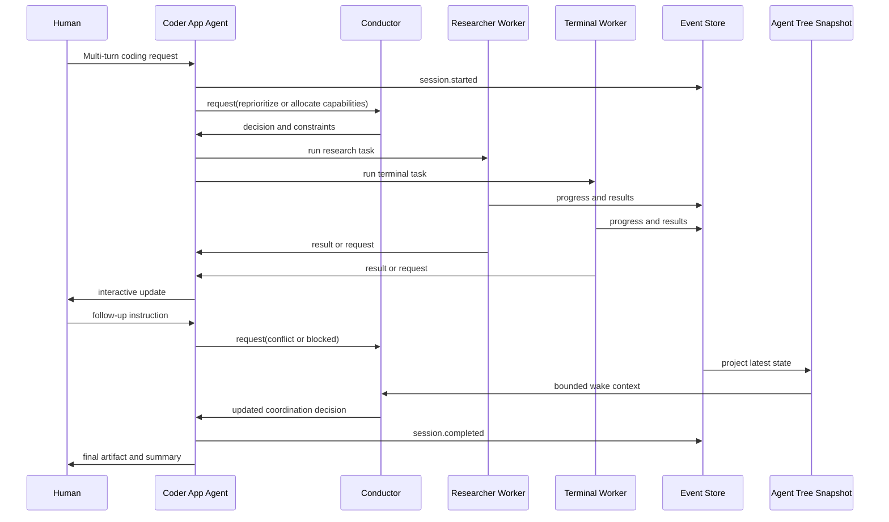

# Three-Level Hierarchy Runtime (Canonical)

Date: 2026-02-14  
Status: Canonical target architecture  
Scope: End-to-end concurrent multi-agent runtime with Conductor, App Agents, and Workers

## Narrative Summary (1-minute read)

ChoirOS runtime hierarchy has three levels:
1. Conductor (control plane).
2. App agents (interactive multi-turn domain sessions).
3. Workers (concurrent execution capabilities).

Conductor remains compressed and non-blocking.
App agents (Writer, Tracer, Coder) hold richer interactive context for human+AI workflows.
Workers (Terminal, Researcher, and future workers) execute bounded concurrent tasks.

This split keeps orchestration clean, interaction rich, and execution parallel.

## What Changed

1. Declared app-agent-led interaction as the default human/AI runtime pattern.
2. Clarified that conductor coordinates across app agents and workers, not direct human session detail.
3. Set three-level hierarchy as canonical architecture documentation target.
4. Added render-safe end-to-end diagrams for structure and sequence.

## What To Do Next

1. Make app-agent sessions (Writer, Tracer, Coder) first-class in runtime/API contracts.
2. Keep conductor wake context bounded with agent-tree snapshots only.
3. Ensure workers remain execution-focused and concurrency-friendly.
4. Add integration tests that assert three-level routing and interruptibility.

---

## Core Runtime Structure

1. **Conductor**
   - Global orchestration authority.
   - Non-blocking event-driven turns.
   - Reads bounded `agent_tree_snapshot` wake context.
   - Coordinates app agents and cross-app constraints.

2. **App Agents**
   - Own interactive multi-turn sessions.
   - Examples: Writer, Tracer, Coder.
   - Handle human-facing context continuity and domain workflow state.
   - Delegate execution work to workers and coordinate with conductor when needed.

3. **Workers**
   - Execute bounded capability tasks.
   - Examples: Terminal, Researcher.
   - Return typed `progress`, `result`, `failed`, and `request` messages.
   - Optimized for concurrency and clear capability boundaries.

## End-to-End System Diagram

## Concurrency and Interaction Sequence (Coder Example)

## Control Responsibility Split

1. **Conductor controls:** cross-app orchestration, priority, policy rails, budgets, cancellation.
2. **App agents control:** interactive session continuity, domain decomposition, user-facing turn logic.
3. **Workers control:** local tool execution and capability-bound output production.

## Capability Ownership Boundary (Critical)

1. Conductor is orchestration-only and has no direct tool execution path.
2. Tool schemas are defined once in shared contracts and granted to agents/workers as needed.
3. Terminal and Researcher include `file_read`, `file_write`, and `file_edit` as baseline worker tools.
4. Writer app agent is canonical for living-document/revision mutation authority.
5. Coder app agent delegates concurrent execution to Terminal and Researcher workers.
6. Workers return typed outputs/requests; app agents own interactive continuity and artifact shaping.

## Invariants

1. Conductor does not poll workers or app agents.
2. Conductor turns are finite and interruptible.
3. App agents are the primary human interaction layer.
4. Workers are concurrency units, not orchestration authorities.
5. State and observability are event-backed and scope-isolated.

## Acceptance Signals

1. Human interaction happens through app agents, not direct conductor session simulation.
2. App agents can run multiple workers concurrently and remain interactive.
3. Conductor context remains bounded while app sessions remain rich.
4. Event streams clearly show three-level hierarchy and correlation links.
