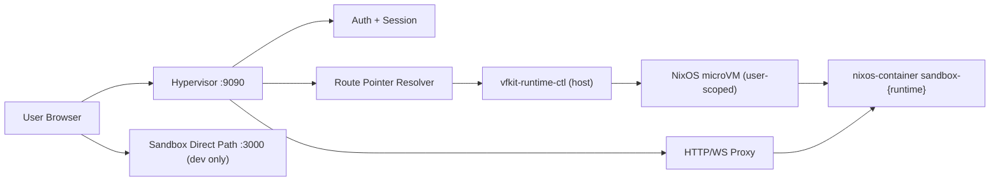

# Local VFKit Architecture Review (Pre-Commit)

Date: 2026-02-28  
Status: Active  
Owner: platform/runtime

## Narrative Summary (1-minute read)

There are now two valid local execution paths, and they are intentionally different:

1. `http://127.0.0.1:3000` is the direct sandbox/dev path.
2. `http://127.0.0.1:9090` is the hypervisor ingress path (auth + runtime routing + vfkit lifecycle).

For cutover parity and deployment-shape validation, `9090` is canonical.  
For isolated frontend/backend feature loops, `3000` remains useful but bypasses hypervisor concerns.

## What Changed

1. Hypervisor is vfkit-first for runtime lifecycle (`vfkit-runtime-ctl` path).
2. Root SPA bootstrap on `GET /` is explicitly served by hypervisor (prevents white-screen 404 during authenticated desktop load).
3. Playwright coverage now includes both:
   1. Hypervisor project (`9090`)
   2. Sandbox project (`3000`)
4. Guest runtime control defaults to reusing an existing sandbox binary (`if-missing`) instead of rebuilding on every ensure.

## What To Do Next

1. Treat `9090` flows as cutover-gating flows; treat `3000` as compatibility/dev loop.
2. Add one explicit command for “force rebuild sandbox binary in guest” before high-confidence proof runs.
3. Stabilize and pass one canonical hypervisor e2e suite that exercises prompt bar + writer + terminal + trace in one run.
4. Commit only after docs + AGENTS + test matrix are aligned to this topology.

## Ports and Roles

1. `9090` (`hypervisor`):
   1. Auth/session endpoints
   2. Admin runtime APIs (`/admin/sandboxes/...`)
   3. Proxy ingress to per-user runtime (`live`, `dev`, `branch-*`)
2. `3000` (`sandbox/dev-ui lane`):
   1. Direct app/backend loop (no hypervisor ingress contract)
3. `8080`, `8081`, `12000-12999`:
   1. Runtime-side local tunnel ports exposed by vfkit runtime control for `live`, `dev`, `branch-*`.

## Canonical Local Topology

```text
Browser
  -> 9090 (Hypervisor ingress)
      -> auth/session + admin APIs
      -> route resolution (main/dev/branch)
      -> vfkit-runtime-ctl ensure/stop
      -> SSH tunnel to user VM guest runtime port
      -> sandbox runtime HTTP/WS (desktop, terminal, writer, trace APIs)
```



## Pre-Commit Findings (Architectural)

1. `[P1]` Dual ingress (`3000` vs `9090`) is currently under-documented and creates operator confusion.
2. `[P1]` Hypervisor e2e and sandbox e2e are mixed in one Playwright config; without a canonical “cutover suite”, pass/fail can be misinterpreted.
3. `[P1]` Guest runtime binary reuse (`if-missing`) improves reliability, but introduces potential staleness risk unless rebuild is explicit.
4. `[P2]` Runtime model still carries `live/dev` role assumptions while branch runtime support is being layered in; this is a transitional model, not final 3-tier end state.

## Commit Readiness Checklist

- [x] Root ingress serves SPA on `/` through hypervisor.
- [x] Runtime control path is vfkit-backed (no process fallback).
- [x] Canonical operator docs mention `9090` as cutover ingress.
- [ ] Canonical hypervisor e2e suite passes consistently with video artifact.
- [ ] Explicit “force guest sandbox rebuild” command is documented and tested.
