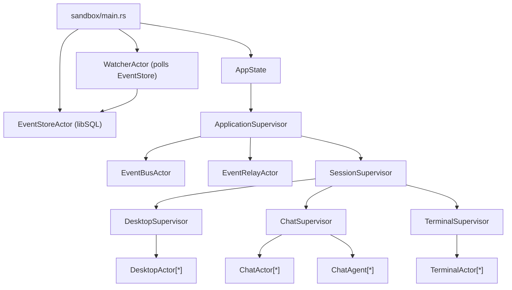
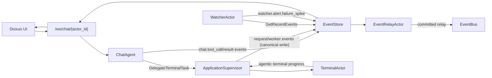
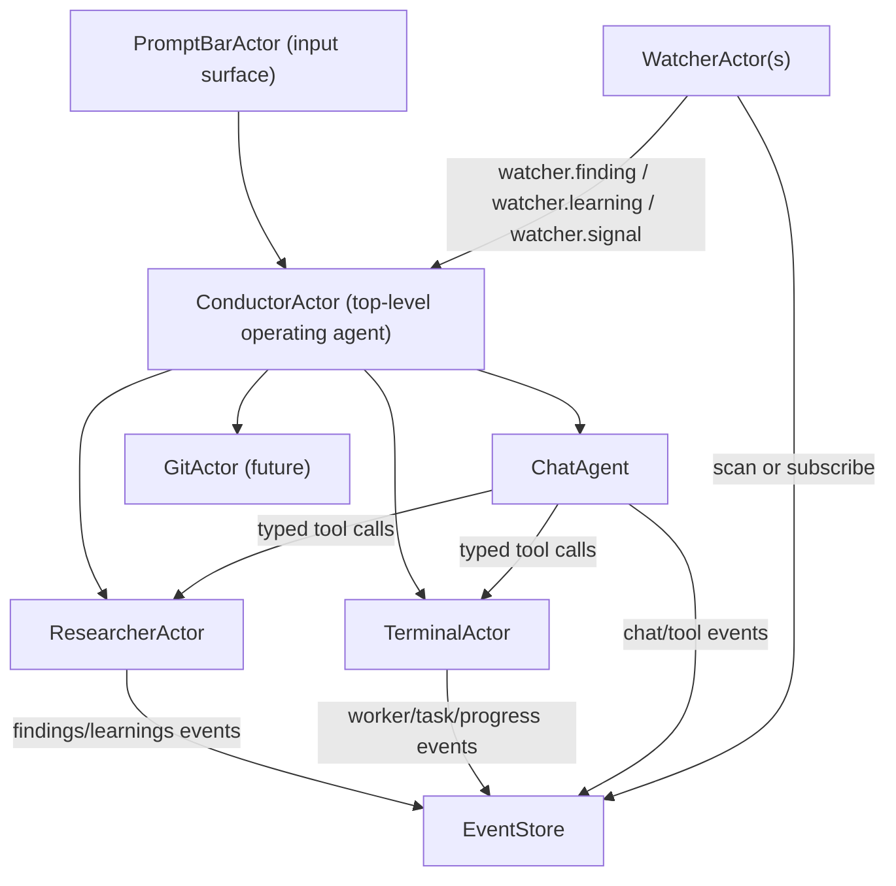

# ChoirOS Actor Network Orientation

Date: 2026-02-08  
Scope: Current network, active build lane, and reserved architecture space

## 1) What We Have (Current Network)

Notes:
- Supervision hierarchy is established and running.
- `ChatAgent` delegates bash-like execution to `TerminalActor` via supervisor async delegation.
- `WatcherActor` is currently deterministic and reads from `EventStore` (not EventBus subscriptions yet).
- `EventRelayActor` relays committed EventStore rows to EventBus (delivery plane).

## 2) Current Event/Data Plane

Notes:
- UI tool/actor timeline is currently driven by reading persisted events from `EventStore`.
- Worker lifecycle and terminal progress are persisted and then streamed to UI.
- This gives replayability and postmortem consistency.

## 3) What We Are Building (Active Lane)

Execution lane:
1. Logging
2. Watcher
3. Researcher

Logging status:
- Added filtered event query path (`GetRecentEvents`).
- Added API surface (`GET /logs/events`).
- Added tests for filtered retrieval and limits.

Watcher status:
- Added deterministic watcher scan loop.
- Added first rule: `worker_failure_spike` -> emits `watcher.alert.failure_spike`.
- Added dedup memory window.

Researcher status:
- Not implemented yet in this pass.
- Architectural expectation: rich lifecycle + citation events from day one.

## 4) What We Are Making Space For

Design intent:
- `PromptBarActor` is not the system brain; it is the universal input channel.
- `ConductorActor` is the orchestration brain.
- Watchers produce structured signals to Conductor, not raw event floods.

## 5) Critical Analysis

### Strengths

- EventStore-first architecture already supports deterministic replay and scoped retrieval.
- Supervision tree and delegation path exist and are operational.
- Chat -> Terminal delegation model is working and observable.

### Risks / Friction

1. Dual event systems overlap
- Both EventBus and EventStore exist.
- Current production observability path is EventStore polling.
- Risk: semantic drift if EventBus topic model diverges from persisted event taxonomy.

2. Event taxonomy fragmentation
- Mixed naming currently exists (`worker_spawned` and `worker.task.started` style families).
- Risk: UI and watcher rules become brittle.

3. Watcher ingestion mode
- Polling EventStore is simple and robust, but adds scan latency and query pressure.
- EventBus subscription is lower latency but currently less authoritative than persisted log flow.

4. Top-level orchestration identity
- Without explicit ConductorActor, orchestration logic can diffuse into app surfaces.
- Risk: policy/scope boundaries become unclear across prompt bar and app agents.

### Immediate design decisions needed

1. Canonical event namespace
- Keep `worker.task.*`, `chat.*`, `watcher.*`, `researcher.*` as authoritative.
- Keep compatibility aliases only as temporary shim.

2. Watcher signal contract
- Add explicit signal kinds:
  - `watcher.finding.created` (factual)
  - `watcher.learning.created` (synthesized, actionable)
  - `watcher.signal.escalation` (urgent/risky)

3. Conductor boundary
- Introduce `ConductorActor` as top-level operating agent.
- Prompt bar sends inputs to Conductor; Conductor delegates to app/tool actors.

4. Researcher observability first
- Researcher should not launch without emitting structured lifecycle + citation events.

## 7) Reconciliation Decision (New)

Architecture gate:
- `docs/architecture/adr-0001-eventstore-eventbus-reconciliation.md`

Decision summary:
- `EventStore` is canonical source of truth.
- `EventBus` is delivery plane only.
- Single-write rule: producers write to EventStore, then committed events may be relayed to EventBus.
- Watchers and replay correctness are EventStore-cursor based.

## 6) Recommended Next Slice

1. Normalize worker and watcher event names under one namespace.
2. Extend watcher rules for timeout/retry/missing completion patterns.
3. Add watcher signal payload schemas (`finding`, `learning`, `escalation`).
4. Start `ResearcherActor` with mandatory event contracts and websocket streaming tests.
