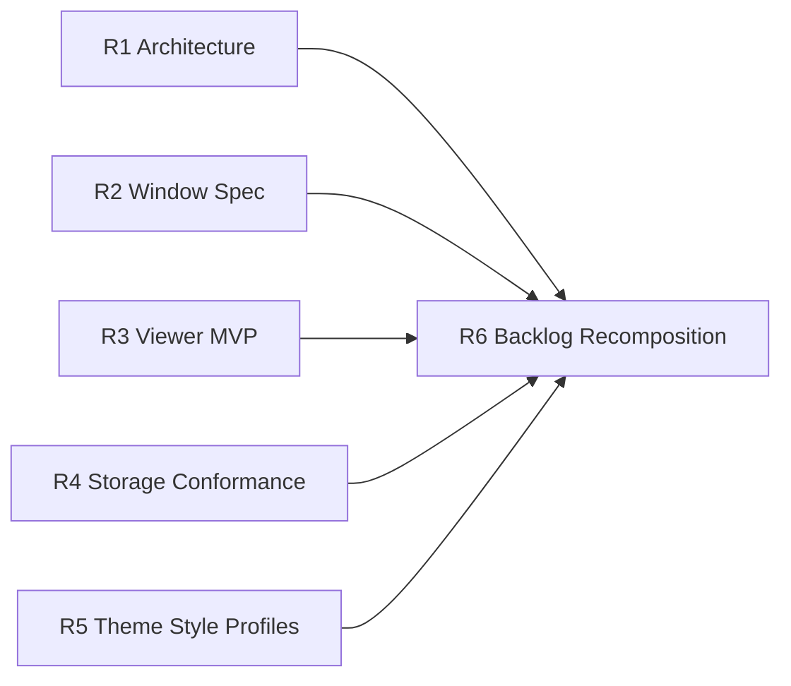

# UI Master Execution Plan (Research -> Parallel Agent Tasks)

**Date:** 2026-02-05
**Status:** Research lanes R1-R5 finalized; ready for R6 backlog recomposition
**Scope:** Consolidates the following documents into one executable plan:
- `docs/content-viewer-research.md`
- `docs/research-dioxus-architecture.md`
- `docs/theme-system-research.md`
- `docs/window-management-research.md`
- `docs/design/2026-02-05-ui-implementation-backlog.md`
- `docs/design/2026-02-05-ui-storage-reconciliation.md`

## 1. Goal

Convert existing UI research and backlog items into parallelizable, agent-executable work with clear contracts, dependency ordering, and acceptance criteria.

This document is intentionally research-first. Implementation should begin only after each research lane publishes an approved execution spec.

## 1.1 Research Output Status (2026-02-05)

Completed lane specs:

- `docs/design/2026-02-05-r1-dioxus-architecture-decomposition.md`
- `docs/design/2026-02-05-r2-window-management-execution-spec.md`
- `docs/design/2026-02-05-r3-content-viewer-mvp-spec.md`
- `docs/design/2026-02-05-r4-storage-conformance-audit.md`
- `docs/design/2026-02-05-r5-theme-style-profile-architecture.md`

Remaining research-planning step:

- `R6` backlog recomposition into implementation control plane.

## 2. Non-Negotiable Architecture Constraints

From `docs/design/2026-02-05-ui-storage-reconciliation.md`:

1. Backend actor/EventStore state is canonical.
2. Browser storage is optional cache only (`localStorage`/`IndexedDB` non-authoritative).
3. On divergence, backend state wins.
4. UI is a projection layer with optimistic UX, not source-of-truth.

All lanes in this plan must pass these constraints before implementation is approved.

## 3. Current Implementation Snapshot (as of 2026-02-05)

### Implemented

1. Dioxus app root + desktop shell exists.
   - `dioxus-desktop/src/main.rs`
   - `dioxus-desktop/src/desktop.rs`
2. Chat and terminal applications are functional.
   - `dioxus-desktop/src/components.rs`
   - `dioxus-desktop/src/terminal.rs`
3. Backend window state/events/APIs are implemented with EventStore persistence.
   - `sandbox/src/actors/desktop.rs`
   - `sandbox/src/api/desktop.rs`
4. Dark mode + theme preference persistence path is implemented (backend + cache + UI toggle).
   - `dioxus-desktop/src/desktop.rs`
   - `sandbox/src/api/user.rs`
   - `shared-types/src/lib.rs`

### Gaps

1. `dioxus-desktop/src/desktop.rs` remains monolithic; architecture decomposition is pending.
2. Frontend drag/resize/minimize/maximize is incomplete in production UX.
   - `dioxus-desktop/src/desktop_window.rs`
3. Dedicated content viewer framework is not implemented yet.
4. Theme system is still toggle-centric and not yet generalized into style-profile architecture.

## 4. Priority Interpretation

- **P0:** State consistency + window interaction architecture + chat parity.
- **P1:** Viewer framework and broader tokenized styling rollout.
- **P2:** Perf/resilience and richer UX enhancements.

Theme style experimentation (user-prompted visual systems like neuebrutalist, glassmorphic, frutiger aero, liquid metal) is treated as **low-priority architecture groundwork** unless it blocks broader UI modularity.

## 5. Parallel Research Lanes (Agent-Executable)

Each lane produces a spec document, task breakdown, and validation checklist.

## Lane R1: Dioxus Architecture Decomposition

**Objective**
Define concrete component boundaries and state ownership split for replacing the current monolith.

**Inputs**
- `docs/research-dioxus-architecture.md`
- `dioxus-desktop/src/desktop.rs`
- `dioxus-desktop/src/components.rs`
- `dioxus-desktop/src/desktop_window.rs`

**Required Outputs**
1. Component map (DesktopShell, Workspace, WindowCanvas, TitleBar, ResizeHandles, PromptBar, status widgets).
2. State map (authoritative backend-projected vs local optimistic signals).
3. File move plan (what code migrates where, in what order, with minimal breakage).
4. Render/perf notes (`key` strategy, memoization targets, rerender hotspots).

**Acceptance Criteria**
- No required behavior loss vs current desktop/chat/terminal behavior.
- Zero conflict with storage reconciliation constraints.
- Produces an implementation sequence with independently mergeable slices.

## Lane R2: Window Management Execution Spec

**Objective**
Translate window-management research into a production-ready contract across backend events and frontend interaction behavior.

**Inputs**
- `docs/window-management-research.md`
- `sandbox/src/actors/desktop.rs`
- `sandbox/src/api/desktop.rs`
- `dioxus-desktop/src/desktop_window.rs`
- `dioxus-desktop/src/interop.rs`
- `shared-types/src/lib.rs`

**Required Outputs**
1. Event/API contract matrix for open/close/focus/move/resize/minimize/maximize/restore.
2. Pointer-event interaction spec (capture lifecycle, bounds, touch behavior).
3. Z-index/focus policy including active window and keyboard behavior.
4. Frontend/backend throttling strategy for high-frequency move/resize updates.

**Acceptance Criteria**
- Clear definition of authoritative state transitions.
- Accessibility baseline for controls and keyboard interactions.
- Explicit test plan for drag/resize correctness and persistence.

## Lane R3: Content Viewer MVP Spec

**Objective**
Define a minimal but extensible viewer framework, including first viewer types and integration contracts.

**Inputs**
- `docs/content-viewer-research.md`
- `dioxus-desktop/src/desktop_window.rs`
- `dioxus-desktop/src/api.rs`

**Required Outputs**
1. Viewer shell contract (loading/error/metadata/actions/content regions).
2. MVP viewer set (recommended: text + image; optionally pdf).
3. JS interop decisions (CodeMirror 6 vs alternatives, loading strategy).
4. Persistence/data flow contract consistent with backend-first policy.

**Acceptance Criteria**
- No client-only source-of-truth for viewer metadata/content.
- Viewer lifecycle defined for open/close/reload/failure paths.
- Bundle/perf expectations and lazy-load strategy documented.

## Lane R4: Storage Reconciliation Conformance Audit

**Objective**
Prove that each planned feature and current implementation respects backend-canonical storage rules.

**Inputs**
- `docs/design/2026-02-05-ui-storage-reconciliation.md`
- `docs/design/2026-02-05-ui-implementation-backlog.md`
- `dioxus-desktop/src/api.rs`
- `dioxus-desktop/src/components.rs`
- `dioxus-desktop/src/desktop.rs`
- `sandbox/src/api/user.rs`

**Required Outputs**
1. Feature-by-feature conformance matrix: pass/fail/risk.
2. Conflict-resolution table (cache stale, reconnect, partial event replay, race cases).
3. Required contract/test additions for unresolved cases.

**Acceptance Criteria**
- Every fail/risk has a concrete remediation item.
- Chat history parity (HTTP + WS rendering shape) gets explicit test coverage requirements.

## Lane R5: Theme Style-Profile Architecture (Low Priority)

**Objective**
Reframe theming from binary mode toggles into a profile-based style system enabling user-prompted visual directions.

**Inputs**
- `docs/theme-system-research.md`
- `dioxus-desktop/src/desktop.rs`
- `sandbox/src/api/user.rs`
- `shared-types/src/lib.rs`

**Required Outputs**
1. Theme profile model (e.g., `base_theme`, `style_profile`, `custom_overrides`).
2. Token architecture for profile packs (semantic variables + profile overrides).
3. Safety constraints for generated/custom styles (contrast floor, token allowlist, fallback rules).
4. Migration path from current dark/light preference to profile-based preference.

**Acceptance Criteria**
- Backward compatibility with existing stored theme preference.
- Backend remains canonical for persisted preference/profile metadata.
- Supports future profiles: neuebrutalist, glassmorphic, frutiger aero, liquid metal, hybrid/custom.

## Lane R6: Backlog Recomposition (Depends on R1-R5)

**Objective**
Rewrite the existing backlog into dependency-correct parallel execution lanes for implementation agents.

**Inputs**
- Outputs from R1-R5
- `docs/design/2026-02-05-ui-implementation-backlog.md`

**Required Outputs**
1. New P0/P1/P2 with lane ownership and merge order.
2. Parallelization plan (what can run concurrently, what is gated).
3. Per-lane DoD and required tests.
4. Risk register and rollback strategy.

**Acceptance Criteria**
- No ambiguous ownership.
- No hidden dependencies across lanes.
- Test expectations are explicit before coding starts.

## 6. Dependency Graph

- R1, R2, R3, R4, R5: run in parallel.
- R6: starts after R1-R5 outputs are complete.

## 7. Recommended Agent Deliverable Template

Each lane should output a doc with this structure:

1. Scope and non-goals.
2. Current-state evidence (file references).
3. Proposed contracts/interfaces.
4. Sequence of implementation slices.
5. Test plan (unit/integration/e2e where applicable).
6. Risks and fallback strategy.

## 8. Research Completion Gate

Research phase is complete only when:

1. R1-R5 docs are accepted.
2. R6 backlog recomposition is accepted.
3. Every P0 item has implementation-ready task slices and test requirements.
4. No unresolved conflict with storage reconciliation policy.

## 9. Immediate Next Actions

1. Assign R1-R5 to parallel agents now.
2. Require each lane to deliver one markdown spec under `docs/design/`.
3. Run R6 immediately after all lanes land.
4. Use resulting R6 doc as the implementation control plane.

---

## Appendix A: Suggested Output Filenames

- `docs/design/2026-02-05-r1-dioxus-architecture-decomposition.md`
- `docs/design/2026-02-05-r2-window-management-execution-spec.md`
- `docs/design/2026-02-05-r3-content-viewer-mvp-spec.md`
- `docs/design/2026-02-05-r4-storage-conformance-audit.md`
- `docs/design/2026-02-05-r5-theme-style-profile-architecture.md`
- `docs/design/2026-02-05-r6-ui-backlog-recomposition.md`
