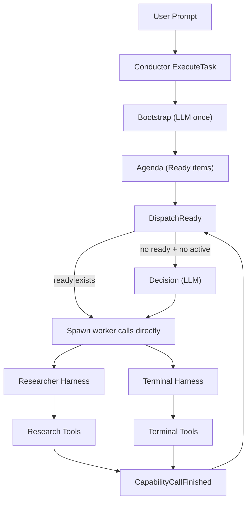
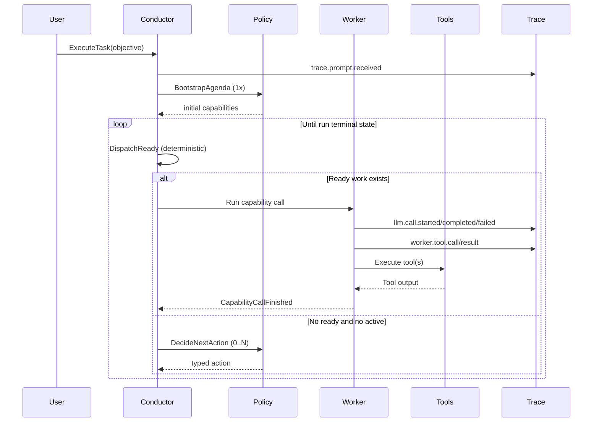

# Harness Simplification Single-Source Handoff

**Date:** 2026-02-14  
**Status:** Active implementation handoff  
**Scope:** Conductor + unified harness simplification (`bootstrap`, `decision`, `worker_port`, `policy`)

## Narrative Summary (1-minute read)

The core system is working but too hard to explain.  
The same run can trigger too many model calls because responsibilities are split across abstractions without a simple contract.

This handoff defines one explainable architecture:

1. `bootstrap` picks initial capabilities once.
2. `dispatch` runs ready agenda items directly.
3. `decision` is called only when there is no ready/in-flight work.
4. `worker_port` executes tools; shared harness services emit progress/report envelopes.
5. `policy` is a pure model-facing boundary (no hidden runtime state mutation).
6. worker harness runtime is one simple while loop with typed actions.

During this simplification phase, **watcher runtime is disabled**.  
Tracing stays exhaustive and remains mandatory for prompt, LLM, and tool-call paths.

## What Changed

- Watcher runtime startup in sandbox is hard-disabled (not env-controlled) to reduce orchestration noise.
- Conductor `DispatchReady` now dispatches ready items before asking policy, reducing repeated policy loops.
- Conductor policy input now includes runtime state summary and explicit capability routing guidance.
- Capability ordering now prefers `researcher` before `terminal`.

## What To Do Next

1. Make the architecture below the only supported runtime path.
2. Reduce model-call count by removing redundant policy/decision turns.
3. Keep tracing mandatory and extend graph hierarchy from prompt -> conductor -> workers -> tools.
4. Ship integration tests that enforce call-count and routing invariants.

---

## 1) Why This Refactor Exists

Current pain points:

- Too many `ConductorDecide` calls for simple objectives.
- Ambiguous boundaries between orchestration and execution concerns.
- Hard to answer: “what are bootstrap, decision, worker_port, policy for?” in one page.
- High cost/latency from unnecessary LLM turns.

Desired outcomes:

- Minimal model calls per run.
- Deterministic orchestration mechanics, semantic model decisions.
- Fully traceable call graph with stable IDs (`run_id`, `call_id`, `trace_id`).
- Simple enough that one diagram matches real code.

---

## 2) Abstraction Contracts (Authoritative)

### `bootstrap` (Conductor policy bootstrap)

Purpose:
- Convert user objective + available capabilities into initial agenda capabilities.

Must:
- Run once per run start.
- Return only capabilities that exist.
- Never dispatch calls itself.

Must not:
- Re-run during normal dispatch loop.

### `decision` (Conductor next-action policy)

Purpose:
- Choose one of: `SpawnWorker`, `AwaitWorker`, `MergeCanon`, `Complete`, `Block`.

Must:
- Run only when no ready agenda items and no active calls.
- Use explicit runtime state summary in prompt input.

Must not:
- Be used as a substitute for deterministic “dispatch ready items” mechanics.

### `worker_port` (Worker execution boundary)

Purpose:
- Map generic harness tool calls into worker-specific execution (`researcher`, `terminal`).

Must:
- Execute tools.
- Keep worker-specific execution constraints.
- Allow shared harness services to emit progress/report envelopes and traces.

Must not:
- Perform orchestration decisions or spawn other workers.

### `policy` (Model boundary)

Purpose:
- Own all model calls for conductor and return typed outputs.

Must:
- Be pure from runtime-state perspective (input -> typed decision).
- Emit LLM trace events for start/completion/failure.

Must not:
- Mutate actor state directly.

---

## 3) Current Runtime (Simplified Call Graph)

Key rule:
- `DispatchReady` is deterministic.
- `Decision` is semantic and used sparingly.

---

## 4) Target Runtime (Cost/Latency-Optimized)

Optimization target for simple query (`"whats tech news today"`):

- Conductor bootstrap: `1`
- Conductor decide: `<=2` typical
- Researcher decide: bounded by harness `max_steps`
- Terminal calls: `0` unless objective explicitly local-shell

---

## 5) Tracing Contract (Non-Optional)

Trace every run across three levels:

1. Prompt root:
   - `trace.prompt.received`
2. LLM calls:
   - `llm.call.started`
   - `llm.call.completed`
   - `llm.call.failed`
3. Tool calls:
   - `worker.tool.call`
   - `worker.tool.result`

Required correlation fields on all trace payloads:

- `run_id`
- `task_id`
- `call_id` (when applicable)
- `actor_id`
- `trace_id`

UI requirement:
- Hierarchical graph: prompt -> conductor -> worker branches -> tool nodes.
- Never hide model-call counts per actor.

---

## 6) Watcher Policy During Simplification

Watcher stance for this phase:

- Runtime watcher actor is disabled.
- Watcher code remains in repo for later evaluation.
- Tracing remains active for all live paths (conductor, researcher, terminal, tools).

Rationale:
- Remove one orchestration feedback loop while simplifying core harness behavior.

---

## 7) Implementation Slices

### Slice 1: Runtime Mechanics Cleanup

- Keep `DispatchReady` deterministic and side-effect-light.
- Remove any path that re-enters policy when ready/in-flight work exists.

### Slice 2: Prompt/Policy Boundaries

- Keep bootstrap and decide prompts concise and state-aware.
- Ensure capability routing guidance is present and explicit.

### Slice 3: Adapter Simplification

- Keep adapters execution-only.
- Keep tool tracing exhaustive and typed.

### Slice 4: Observability Completeness

- Enforce run-scoped correlation IDs through every call path.
- Keep run graph view aligned with backend event semantics.

### Slice 5: Test Gates

- Add call-count invariant tests for simple research prompts.
- Add capability-routing invariant tests (news/web -> researcher).
- Add “no watcher runtime” startup test.

---

## 8) Acceptance Criteria

A run is accepted under this refactor when:

- For a simple research prompt, conductor does not loop policy excessively.
- Researcher is selected over terminal for external web/news objectives.
- Every model/tool call appears in trace graph with run-scoped IDs.
- Watcher does not run in normal sandbox startup.
- Code ownership boundaries are explainable from this document alone.
